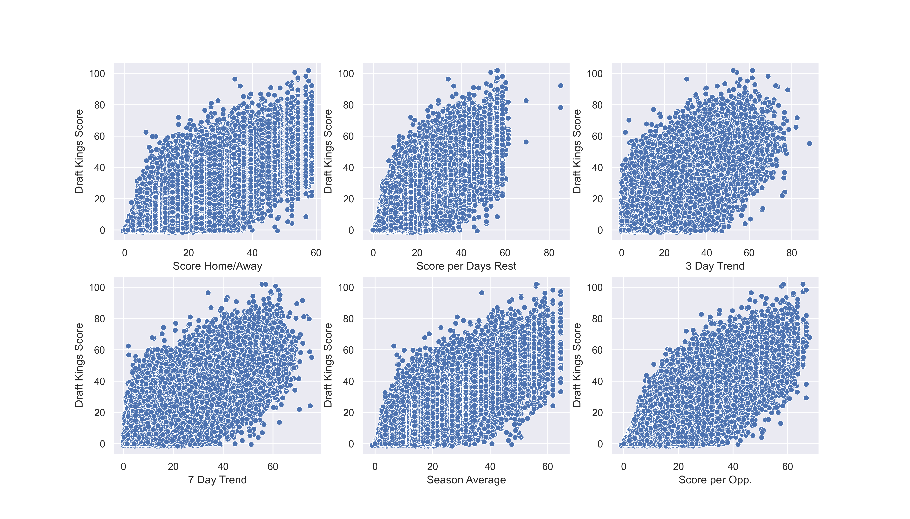
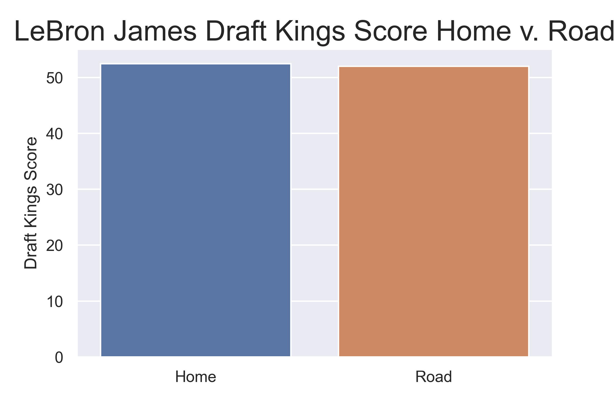
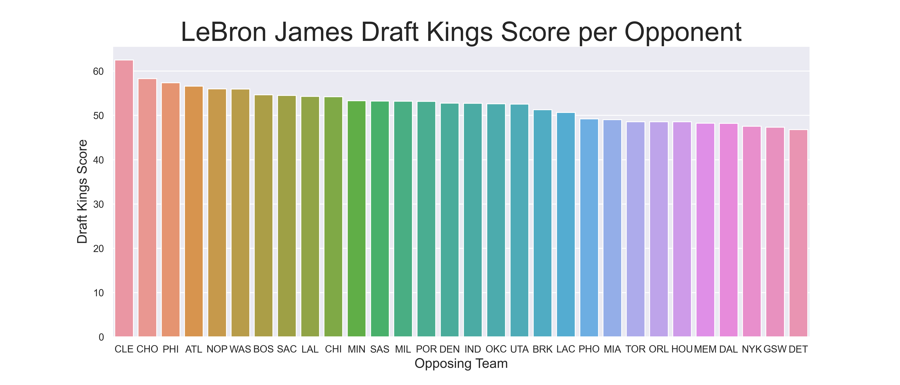
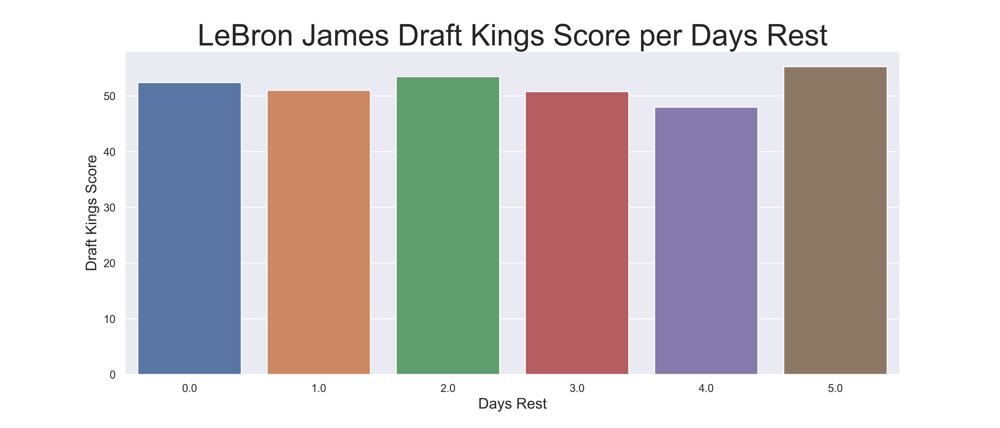

# Metis_Project2_NBA
## Developing an Algorithm to Win Daily Fantasy Sports Competitions

### Description

There are two main daily fantasy sports platforms, DraftKings and FanDuel.  Both allow users to participate in various daily competitions in which users are allocated a "salary cap" and can draft players whose "salary costs" sum to equal or less than that salary cap amount.  Various statistics that a player can generate contribute to their "score".  The goal is to draft players to your team who will score the highest number of fantasy points during the given time period (typically daily). This project aims to predict the number of fantasy points each player will score on a given day, and use that to win the competition (and money).

### Features and Target Variables

- Points, rebounds, assists, steals, blocks, free throws, three points per game along 
	- with home/away splits and per-opponent splits
- Opponent
- Days Rest
- Home/away
- Marquee Matchup (using domain knowledge)
- Rivalry (using domain knowledge)

### Data Used

- 130,000 player-game logs with statistics scraped from basketball-reference.com

### Tools Used

- Numpy
- Pandas
- Matplotlib
- Seaborn
- BeautifulSoup
- Scikit-Lean
- Tableau

### Feature Engineering

There are a lot of potential dummy variables here, if we want to incorporate all opponents, home/away, etc.  My workaround was to calculate each player's average fantasy points scored in each situation.  For example, one column is average fantasy points scored by each player against each team, another is fantasy points scored by each player per number of days rest.  This proved very useful, and I obtained the below correlations for these predictive variables.

And it all depends on the player.  For an example, we will look at LeBron's variability across various predictive features.  Here are his splits.

### Results

Using all of the engineered features, the model was able to produce an R squared of 0.66 with a Mean Absolute Error of just 8 fantasy points.  Considering the highly variable nature of the target variable (standard deviation of fantasy points scored is 14), this is a successful result.
